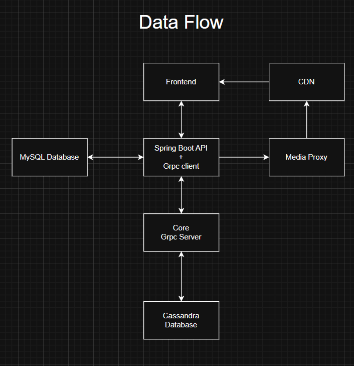

# Drocsid Documentation

## Description

The main goal is to create an app called **Drocsid**, which is a clone of the existing **Discord** application, mirroring its architecture and providing the most important functionalities.

## Project Team

-   Rafał Mironko
-   Jakub Mieczkowski
-   Bartosz Mączka
-   Maciej Cieślik
-   Mateusz Daszewski

## Architecture

### Flow chart

#### Frontend

Frontend is the visual layer made in TypeScript using React framework. It connects directly to the backend. Another task is to extract Google OAuth token and forward it for further verification to the backend.

#### Backend

Backend is a middle layer written in Java using Maven and Spring Boot framework between frontend and backend and serves as a proxy.

It works on REST API, transforming requests to gRPC and sending it to core. An additional but also important task for the backend is to authenticate the user using Google OAuth token and to map it to proper user id.

All this data is stored in MySQL database, which connects to backend via JPA.

#### Core

Core is the major layer on the app, which is responsible for all main logic. It receives an authed user’s id, which corresponds to the user's id who is verified, provided by the backend.

Requests supporting gRPC framework. Core is designed in Elixir, enabling high speed and performance.

### Databases and services

#### Cassandra database

Responsible for storing all app data excluding Google OAuth tokens. Core is the only layer which has direct access to that database.

#### MySQL database

Responsible for storing Google OAuth tokens and their mappings to user_id’s. Backend is the only layer which has access to that database.

#### CDN service

CDN (Content Delivery Network) service is a containerized storage build on Azure Azurite. It provides storage for uploaded media.

#### Media proxy

Media proxy is a processing and optimization service for uploaded media. It's a middleware between frontend/backend and CDN.

Media proxy receives media uploads from frontend that are passed through backend. Uploaded files are then processed to different quality levels (videos are not processed).

Media proxy was implemented to reduce bandwidth by creating multiple compressed versions of images and to separate image processing from the backend. This allows frontend to choose quality based on client needs (thumbnail, full resolution image).

## Dockerisation

App deployment relays on Docker.

### Containers

-   **frontend** – served on 5173
-   **backend** – exposed on 8080/9090 (REST API / gRPC)
-   **cassandra** – main Cassandra database exposed on port 9042
-   **cassandra-init** – applies the schema (schema.cql) after Cassandra becomes ready
-   **core** – exposed on 50051
-   **mysql** – MySQL database with persistent storage on mysql_data on port 3306
-   **cdn** – custom CDN service storing data in a dedicated volume, exposed on 10000
-   **mediaproxy** – media proxy service running on 9000

### Volumes

-   **cdn** – for CDN file storage
-   **mysql_data** – for MySQL persistence

### Functionalities

-   register or log in using Google oauth
-   create Drocsid Server
    -   create channels,
    -   edit channels,
    -   add users,
    -   change name,
    -   delete server,
    -   join other servers
-   use Drocsid Servers
    -   send messages
    -   send images
    -   send videos
-   change color theme

### Functionalities we didn't manage to complete

-   adding friends
-   manaigng roles
-   sending gifs

## RUNBOOK

### Env file
Setup in root directory .env file with this variables:
-   CDN_PUBLIC_HOST pointing to <protocol>://<public_url>/cdn
-   VITE_API_BASE_URL=<protocol>://<public_url>/api
-   GOOGLE_OAUTH_CLIENT_ID=<your google oauth client id>
-   AZURE_STORAGE_ACCOUNT=devstoreaccount1
-   AZURE_STORAGE_ACCOUNT_KEY=Eby8vdM02xNOcqFlqUwJPLlmEtlCDXJ1OUzFT50uSRZ6IFsuFq2UVErCz4I6tq/K1SZFPTOtr/KBHBeksoGMGw==

### Initialization

1. Setup .env in root directory
2. docker compose up --build
3. wait until cassandra init finishes
4. run docker compose up --build once again
5. enter http://localhost:8090
